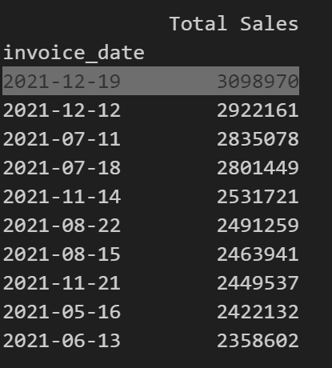

# 1. Combine and clean the data.
***Inputs:***  athletic_sales_2020.csv and athletic_sales_2021.csv files

*Setup, inspect and clean the data:*
- pd.read_csv() to create two DataFrames sales_20_df and sales_21_df
- reviewed the output and shape of both DataFrames
- combine using pd.concat() sales_20_df and the sales_21_df DataFrames to sales_20_21_df, reset the index and drop the original index
- isnull().sum() to on sales_20_21_df to see if any null values (to clean).  There weren't any null values in the combined df
- info() to check datatypes, then copied sales_20_21_df to converted_sales_20_21_df and reset invoice_date to datetine format using datetime()
- Verified invoice_date now datetime64[ns] type
- Used converted_sales_20_21_df throughout the rest of the program.  As the base data set

# 2. Determine which region sold the most products:
***Answer:*** Northeast (NY/NY) region sold the most products @ 111954

*Using groupby*
- converted_sales_20_21_df.groupby(['region', 'state', 'city'])[["units_sold"]].sum() to create total_sold_regions_state_city_df, then changed 'units_sold' to "Total_Products_Sold"
- sort_values by Total_Products_Sold, descending and used head(5) to dipslay the top 5 regions in terms of total products sold

*Using pivot_table*
- pd.pivot_table(converted_sales_20_21_df,values='units_sold', index=['region', 'state', 'city'], aggfunc='sum') to create sales_20_21_pivot
- renamed 'units_sold', sorted by "Total_Products_Sold, descending, and print() and head(5) to output the top 5 regions in terms of products sold.

*Verified results*

# 3. Determine which region had the most sales.
***Answer*** Northeast (NY/NY) @ 39801235

*Using groupby*
- Followed the exact same steps as in section 2, above.  Justed used 'total_sales' vs. 'units_sold' colmn data.
- Renamed 'total_sales', sorted by 'Total Sales', and output the top 5 regions by sales.

*Using pivot_table*
- pd.pivot_table(converted_sales_20_21_df, values='total_sales', index=['region', 'state', 'city'],aggfunc='sum') to create sales_20_21_pivot_tot_sales
- renamed 'total_sales', sorted by 'Total Sales', and output the top 5 regions by sales.

*Verified results:*

# 4. Determine which retailer had the most sales.
***Answer*** WestGear (West/CA/SF) @ 32794405

*Using groupby*
- Followed the exact same steps as in section 3, above.  Just added 'retailer' to index= [list (columns)]
- Used 'total_sales' as the value and sales_20_21_tot_sales to remane 'total_sales', sort by 'Total Sales', and output the top 5 retailers by sales.

*Using pivot_table*
- pd.pivot_table(converted_sales_20_21_df, values='total_sales', index=['retailer', 'region', 'state', 'city'],aggfunc='sum') to create stotal_sales_retailer_region_state_city_pivot
- renamed 'total_sales', sorted by 'Total Sales', and output the top 5 retailers by sales

*Verified results:*

# 5. Determine which retailer sold the most women's athletic footwear.
***Answer***  WestGear (W/CA/SF) @ 12107

*Setup*
- womens_converted_sales_20_21_df = converted_sales_20_21_df[converted_sales_20_21_df['product'] == "Women's Athletic Footwear"] to create omens_converted_sales_20_21_df.  New df only includes products == "Women's Athletic Footwear"

*Using groupby*
- total_sold_retailer_region_city_state_womens_df = womens_converted_sales_20_21_df.groupby(['retailer', 'region', 'state', 'city'])[["units_sold"]].sum() to create total_sold_retailer_region_city_state_womens_df
- Used 'total_sales' as the value and sales_20_21_tot_sales to remane 'total_sales', sort by 'Womens_Footwear_Units_Sold', and output the top 5 retailers by units.

*Using pivot_table*
- pd.pivot_table(womens_converted_sales_20_21_df, values='total_sales', index=['retailer', 'region', 'state', 'city'],aggfunc='sum') to create total_sales_retailer_region_state_city_womens_pivot
- renamed 'total_sales', sorted by 'Womens_Footwear_Units_Sold', and output the top 5 retailers by units

*Verified results:*

# 6. Determine the day with the most women's athletic footwear sales
***Answer*** 2020-01-04    @     402743

*Setup*
- pd.pivot_table(womens_converted_sales_20_21_df, values='total_sales', index=['invoice_date'], aggfunc='sum') to create total_sales_women_footwear_date_pivot.  Index on 'invoice_date'
- rename 'total_sales' and print the pivot table

*Resample*
- avg_daily = total_sales_women_footwear_date_pivot.resample('D').sum()
- print the avg_daily pivot table, sorting by Total Sales in descending order, ad the top 10 days of total sales.
*Verified results*

# 7. Determine the week with the most women's athletic footwear sales.
***Answer*** 2021-12-19   @     3098970

*Resample*
- avg_weekly = total_sales_women_footwear_date_pivot.resample('W').sum()
- print the avg_weekly pivot table, sorting by Total Sales in descending order, ad the top 10 days of total sales.
*Verified results*

---
UNC Bootcamp, Module 5 Challenge completed by Lou Canjar